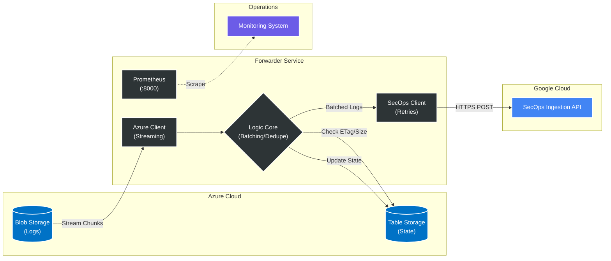
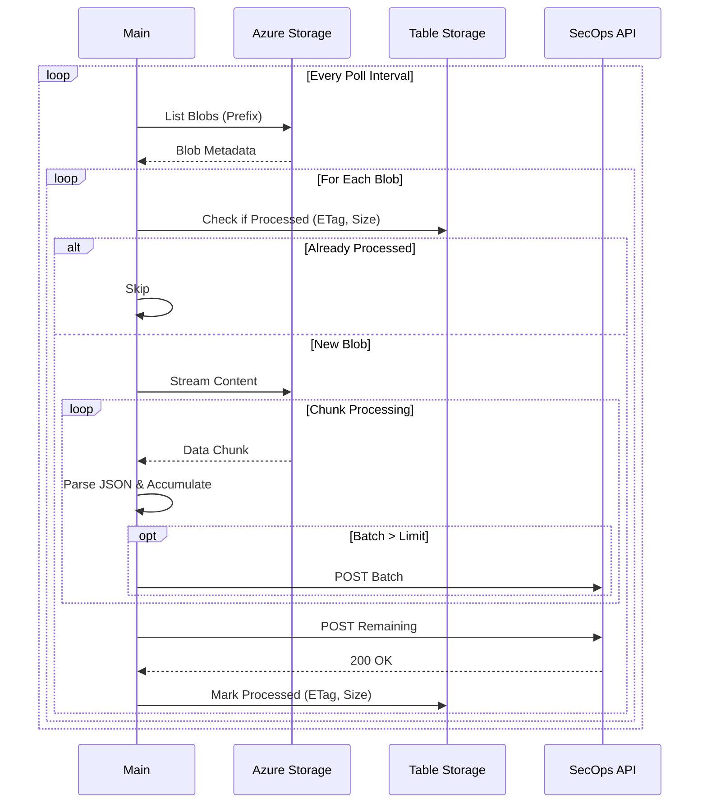

# Azure to Google SecOps Log Ingestion


A robust, scalable, and stateless forwarder service designed to ingest custom logs from **Microsoft Azure Blob Storage** into **Google Security Operations (SecOps)**.

---

## 📖 Overview

This solution bridges the gap between Azure's storage-centric logging and Google SecOps' ingestion API. While Google SecOps provides native feeds for standard Azure services (Activity Logs, Entra ID), custom applications and specific Azure services often export logs to Blob Storage in formats that require custom handling.

This forwarder provides:
- **Stateless Design**: Uses Azure Table Storage for distributed state tracking.
- **Memory Safety**: Streams large log files to prevent OOM errors.
- **Resilience**: At-least-once delivery guarantee with automatic retries and backoff.
- **Efficiency**: Smart batching to respect SecOps API limits (10MB payloads).
- **Concurrency**: Parallel processing of multiple containers.
- **Observability**: Prometheus metrics endpoint for monitoring throughput and health.

---

## 🏗 Architecture

The system follows a poll-process-push model, designed for horizontal scalability.



### 🔄 Ingestion Logic Flow



---

## 🚀 Getting Started

### Prerequisites

- **Azure Subscription**: With Storage Accounts containing logs.
- **Google Cloud Project**: With SecOps API enabled and a Service Account key.
- **Docker**: For building and running the forwarder.
- **Terraform**: For deploying the infrastructure.

### 1. Infrastructure Deployment

We use Terraform to provision the necessary Azure Storage resources, including the Table Storage for state.

```bash
cd infra/terraform
terraform init
terraform apply -var="storage_account_name=stsecopslogs001"
```

This will create:
- Storage Account for logs.
- Blob Containers (`custom-logs`, `activity-logs`, etc.).
- **Table Storage** (`forwarderstate`) for forwarder state tracking.
- **Output**: The connection string for the storage account (sensitive).

### 2. Configuration

Create a `config.yaml` file based on the example:

```yaml
env: "prod"
azure:
  tenants:
    - name: "primary-tenant"
      storage_accounts:
        - name: "stsecopslogs001"
          account_url: "https://stsecopslogs001.blob.core.windows.net"
          # Optional: Env var name for this specific account's connection string
          connection_string_env_var: "CONN_STR_STSECOPSLOGS001"
          containers:
            - name: "custom-logs"
              prefixes: ["firewall/", "waf/"]
              log_type: "AZURE_CUSTOM_FIREWALL"
gsecops:
  ingestion_endpoint: "https://malachiteingestion-pa.googleapis.com/v1/ingestion"
  customer_id: "YOUR_CUSTOMER_ID"
forwarder:
  poll_interval_seconds: 60
  state_container: "forwarderstate" # Table Name
  max_parallel_containers: 4
  batch_size: 500 # Max logs per batch (approx)
  max_bytes_per_batch: 5000000 # 5MB limit (SecOps limit is 10MB)
```

### 3. Running the Forwarder

The forwarder requires credentials for both Azure and Google Cloud.

**Environment Variables:**
- `AZURE_STORAGE_CONNECTION_STRING`: Default connection string for log storage.
- `AZURE_STATE_CONNECTION_STRING`: Connection string for state storage.
- `GOOGLE_APPLICATION_CREDENTIALS`: Path to your GCP Service Account JSON key.
- `FORWARDER_POLL_INTERVAL_SECONDS`: (Optional) Override poll interval.
- `CONN_STR_STSECOPSLOGS001`: (Optional) Specific connection string if configured in `config.yaml`.

**Docker Run:**

```bash
# Build the image
docker build -t secops-forwarder ./forwarder

# Run the container (exposing port 8000 for metrics)
docker run -d \
  --name secops-forwarder \
  -p 8000:8000 \
  -e AZURE_STORAGE_CONNECTION_STRING="..." \
  -e AZURE_STATE_CONNECTION_STRING="..." \
  -e GOOGLE_APPLICATION_CREDENTIALS="/app/key.json" \
  -v $(pwd)/config.yaml:/app/config.yaml \
  -v $(pwd)/gcp-key.json:/app/key.json \
  secops-forwarder
```

---

## 📊 Observability

The forwarder exposes Prometheus metrics on port **8000** at `/metrics`.

**Key Metrics:**
- `secops_forwarder_blobs_processed_total`: Blobs successfully ingested.
- `secops_forwarder_blobs_failed_total`: Blobs that failed processing.
- `secops_forwarder_log_entries_skipped_total`: Malformed JSON lines skipped.
- `secops_forwarder_batches_sent_total`: Batches successfully sent to SecOps.
- `secops_forwarder_processing_time_seconds`: Histogram of blob processing duration.

---

## 🛠 Development & Customization

### Adding New Log Sources
1.  **Export**: Configure your Azure resource to export logs to a Blob Container in the SecOps Storage Account.
2.  **Config**: Add the container and prefix to `config.yaml`.
3.  **Restart**: Restart the forwarder to pick up the new configuration (or send SIGTERM to trigger graceful shutdown).

### Monitoring
The forwarder outputs structured logs to `stdout`. Monitor these logs for:
- `INFO`: Normal processing (blobs found, batches sent).
- `WARNING`: Configuration issues or transient errors.
- `ERROR`: Failed ingestion or connectivity issues.

---

## 🔒 Security

- **Least Privilege**: The Azure SAS token or Identity should only have `Storage Blob Data Reader` on log containers and `Storage Table Data Contributor` on the state table.
- **Encryption**: All data in transit is encrypted via TLS 1.2+.
- **Secrets**: Never commit keys to repo. Use Azure Key Vault or GCP Secret Manager in production.

---

## 📄 License

This project is licensed under the Apache 2.0 License.
